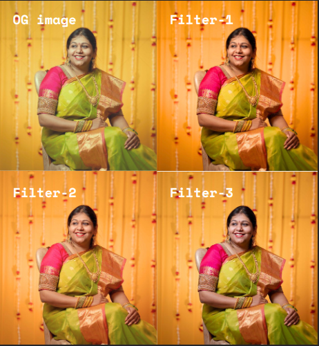
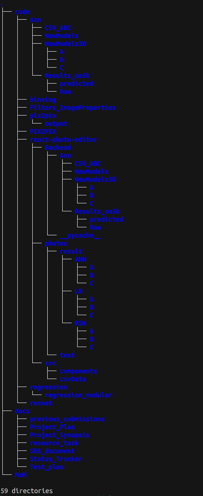

# Automated Colour Correction

Automated Colour Correction is an AI-powered tool designed to streamline the workflow of professional photographers, particularly those in the wedding industry. By uploading raw photos, photographers can let our algorithms predict and apply the best color corrections, drastically reducing manual editing time. The tool also allows for manual adjustments and batch processing of photos, ensuring both efficiency and high-quality results. It can Do task of 7-8 hours in 2-3 Minutes

## Project Description

Professional photographers often spend countless hours manually editing photos to achieve the perfect color balance. This process is not only time-consuming but also prone to inconsistencies. The need for an automated solution that can deliver consistent, high-quality color corrections is paramount. Automated Colour Correction addresses this issue by leveraging advanced AI models to automate the color correction process, thereby saving photographers valuable time and effort.

## Product Overlook
- [Final Presentation](./Presentration.pdf)
- [Video Of Website](https://youtu.be/ypNMGmxHNFA)
- 
- For More photos go to 
    ```sh
    cd code 
    cd react-photo-editor
    cd photos
    ```

## Features
- **AI-Powered Color Correction**: Utilizes advanced neural networks to predict and apply optimal color corrections.
- **Batch Processing**: Efficiently processes large batches of photos. 
- **Manual Adjustments**: Provides options for manual tweaks to ensure every photo meets the photographer's standards.
- **Downloadable Results**: Allows users to download the edited photos seamlessly.

## Concepts and Technologies Used
- **Machine Learning Models**: ResNet, Artificial Neural Networks, Regression
- **Frontend Development**: React
- **Image Processing**: OpenCV
- **Dataset**: Adobe 5k

## Requirements and Dependencies
- Python 
- React
- OpenCV
- TensorFlow (for implementing neural networks)
- Adobe 5k Dataset

## Directory Structure



## Installation and Setup
1. **Clone the repository:**
    ```sh
    
    git clone https://github.com/harsh-gupta10/Automated-Colour-Correction.git
    cd Automated-Colour-Correction
    ```


2. **To Start Frontend:**
    ```sh
    cd code 
    cd react-photo-editor
    npm install
    npm run dev 
    ```

3. **To Start Backend**
    ```sh
    cd code 
    cd react-photo-editor
    cd Backend
    flask run
    ```

## Usage
1. **Upload Photos**: Drag and drop or select raw photos Folder to upload.
2. **Automatic Correction**: Let the AI algorithms automatically apply color corrections.
3. **Manual Adjustments**: If necessary, make manual adjustments to individual photos.
4. **Download**: Once editing is complete, download the edited photos in ZIP.

## Further Work
- **Model Improvements**: Enhance the accuracy and efficiency of the AI models.
- **Setup PipeLIne** For Now It is only a testing Application. No proper Integration Of Ml Model with UI.

## Contributing
We welcome contributions from the community. Please fork the repository, create a branch, and submit a pull request for review.

## Contributors
- [Abhinav Raundhal](https://www.linkedin.com/in/abhinav-raundhal-2355192a8/)
- [Ishan Gupta](https://github.com/Ishan-1)
- [Sujal Deoda](https://github.com/Su-1042)
- [Yattapu Deekshitha](https://github.com/deekshitha12345)


## Documentation
### Minutes of Meetings (MOMs)
All MOMs with the client and internal team meetings are documented in the `MOM` directory. This includes detailed notes on discussions, decisions made, and action items.

### Design Document
The design document, located in the `docs/DesignDoc.pdf` , provides a comprehensive overview of the system architecture, including diagrams and detailed descriptions of each component.

### Project Plan
The project plan, found in the `docs/Project_plan` directory, outlines the timeline, milestones, and deliverables for the project. It also includes risk assessments and mitigation strategies.

### Software Requirements Specification (SRS)
The SRS document, available in the `docs/SRS_document` directory, defines the functional and non-functional requirements of the project, ensuring all stakeholder needs are addressed.

### Status Tracker
The status tracker, located in the `docs/Status_Tracker` directory, provides an ongoing log of project progress, including completed tasks, upcoming milestones, and any issues encountered.

### Test Plan
The test plan, found in the `docs/Test_plan` directory, outlines the testing strategy, test cases, and testing schedule to ensure the quality and reliability of the application.

### Project Synopsis
The project synopsis, available in the `docs/Project_Synopsis` directory, provides a summary of the project, including objectives, key features, and outcomes.

---

Say goodbye to tedious editing tasks and hello to efficiency and excellence with Automated Colour Correction!
